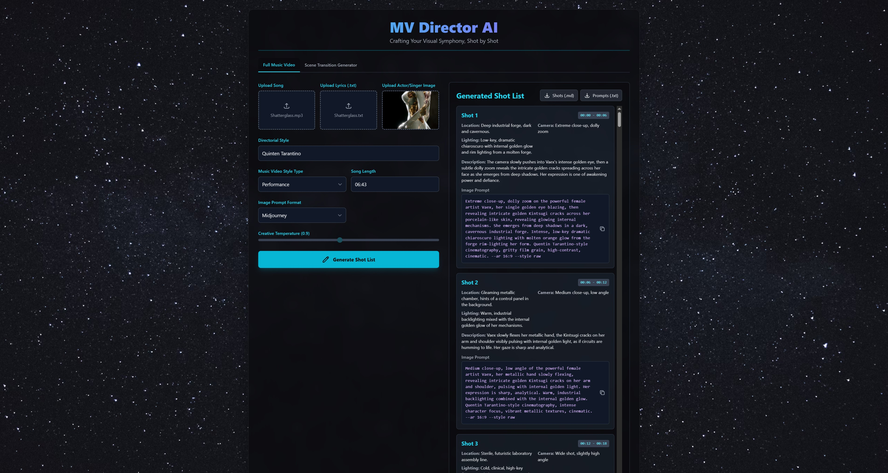
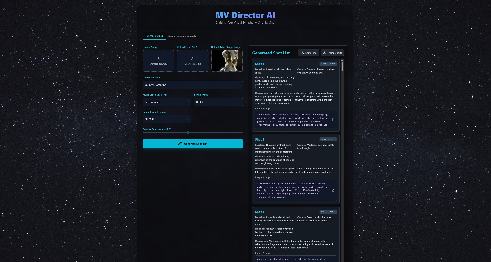

# MV Director AI

Crafting Your Visual Symphony, Shot by Shot.

MV Director AI is an AI-powered application that generates a detailed music video shot list based on a song, lyrics, directorial style, and visual concepts. It can also generate creative transitions between scenes.

## Features

-   **Full Music Video Shot List Generation**: Upload a song, lyrics, and an image of the artist to generate a complete shot-by-shot storyboard for your music video.
-   **Scene Transition Generation**: Provide two video clips and get a creative transition shot to bridge them seamlessly.
-   **Customizable Styles**: Define directorial, music video, and artistic styles to match your vision.
-   **Multiple AI Prompt Formats**: Generate image prompts tailored for Midjourney, Stable Diffusion 1.5, and FLUX AI.
-   **Exportable Results**: Download your shot list as a Markdown file and your image prompts as a text file for easy integration into your workflow.

## How to Run Locally

This section provides instructions for setting up and running the application on your local machine.

### Instructions

1.  **Install dependencies**:
    Run the 1_setup_node_js.bat file to install Node.js.
    
2.  **Install NPM and run the app**:
    Run the 2_setp_npm_and_run_npm.bat to both install and run the NPM server.

3. **Enter API Key**: Once the application is running, open it in your browser. You will see an input field for your **Gemini API Key** under the site Header. Paste your key into this field to enable the app's features. The key will be saved in your browser's local storage for future sessions. If you don not know         where to locate your google gemini API key;

   1. Go to https://aistudio.google.com/apikey

   2. You'll be greeted with the following pop-up if you don not have one already  and choose "Build with Gemini API Get API Key"
      

   3. In the top right corner click the "+ Create API KEY" button
      
      

## How to Use

### Getting Started

Before you begin, you must enter a valid **Gemini API Key** in the input field at the top of the application. The application will not work without it.

### Full Music Video Shot List Generator

This page helps you generate a complete storyboard for your music video. Here's a breakdown of each field:

-   **Upload Song**: Upload the audio file (`.mp3`, `.wav`, etc.) for your music video. The AI analyzes the mood and structure of the music.
-   **Upload Lyrics (.txt)**: Provide a `.txt` file with the song's lyrics. This is crucial for creating shots that align with the narrative and emotional content of the song.
-   **Upload Actor/Singer Image**: Upload a clear image of the main artist. The AI uses this as a visual reference for the character in the video, influencing descriptions and prompts.
-   **Actor/Singer's Name (Optional)**: Enter the artist's name. This can help the AI create more personalized and accurate descriptions.
-   **Directorial Style**: Specify the style of a director you want to emulate (e.g., "Wes Anderson's symmetry and color palettes," "Guillermo del Toro's dark fantasy"). This guides the AI's choices in cinematography and mood.
-   **Music Video Style**: Choose the overall genre of your video from the dropdown. A "Narrative" style will focus on storytelling, while a "Performance" style will focus on the artist's performance.
-   **Artistic Style**: Select a visual style from the extensive list. This is a key input that dictates the entire aesthetic of the generated shots, from "Cyberpunk" to "Oil Painting".
-   **Song Length**: Enter the song's duration in `MM:SS` format (e.g., `03:45`). This helps the AI properly time and distribute the shots across the entire song.
-   **Image Prompt Format**: Choose the AI image generator you plan to use. The prompts will be tailored for specific formats: Midjourney provides a descriptive, stylized prompt; Stable Diffusion 1.5 provides a tag-based prompt; and FLUX AI provides a verbose, single-sentence prompt.
-   **Video Format**: Select `Horizontal 16:9` for standard widescreen videos or `Vertical 9:16` for mobile-first content like TikTok or Instagram Reels.
-   **Shot Length (seconds)**: Determine the average length of each shot. Shorter lengths create a faster-paced video, while longer lengths create a slower, more deliberate feel.
-   **Creative Temperature**: This slider controls the AI's creativity. Lower values produce more conventional and predictable results, while higher values lead to more unique and experimental ideas.
-   **Generate Shot List**: Once all fields are filled, click this button to begin the generation process.

### Scene Transition Generator

This page is designed to create a single, compelling shot that bridges two existing scenes from your shot list.

-   **MV Shot List (.md)**: Upload the `.md` shot list file you previously generated and saved. This gives the AI the full context of the project's style and narrative.
-   **Upload Video for Scene 1 (From)**: Upload the video clip of the shot you are transitioning *from*. The AI will analyze the final frames for visual cues. After uploading, a **Last Frame (.png)** button will appear, allowing you to download a snapshot of the video's final frame for your reference.
-   **Upload Video for Scene 2 (To)**: Upload the video clip of the shot you are transitioning *to*. The AI will analyze the opening frames. Similarly, a **First Frame (.png)** button will appear for downloading a snapshot of the video's first frame.
-   **Transition From Shot #**: Select the number of the shot that the transition starts *after*.
-   **Transition To Shot #**: Select the number of the shot that the transition leads *into*.
-   **Directorial, Music Video, and Artistic Style**: These fields should typically match the styles you used for the full shot list to ensure consistency.
-   **Video Format**: Ensure this matches the format of your main project.
-   **Transition Length (sec)**: Choose the duration of the transition shot. 1-3 seconds is typical.
-   **Creative Temperature**: Adjust the creativity for the transition idea.
-   **Generate Transition**: Click this to generate the description and AI video prompt for your transition shot.

## Examples

### Full Music Video Generator
The main interface for generating a full music video shot list from your creative inputs.

### Scene Transition Generator
The interface for generating a transition between two video scenes.

### Scene Transition Output Example
An example of a generated transition sequence, bridging two scenes with a new creative shot.

### Prompt Format Examples

#### Midjourney
An example of a generated shot list with prompts formatted for Midjourney.

#### Stable Diffusion 1.5
An example of a generated shot list with prompts formatted for Stable Diffusion 1.5.

#### FLUX AI
An example of a generated shot list with prompts formatted for FLUX AI.

## Credit & Support

If you use this application, please give credit to **SheaGryphon** or **Cortney Griffey**.

If you find this tool helpful, consider supporting the creator by buying a coffee! ☕

